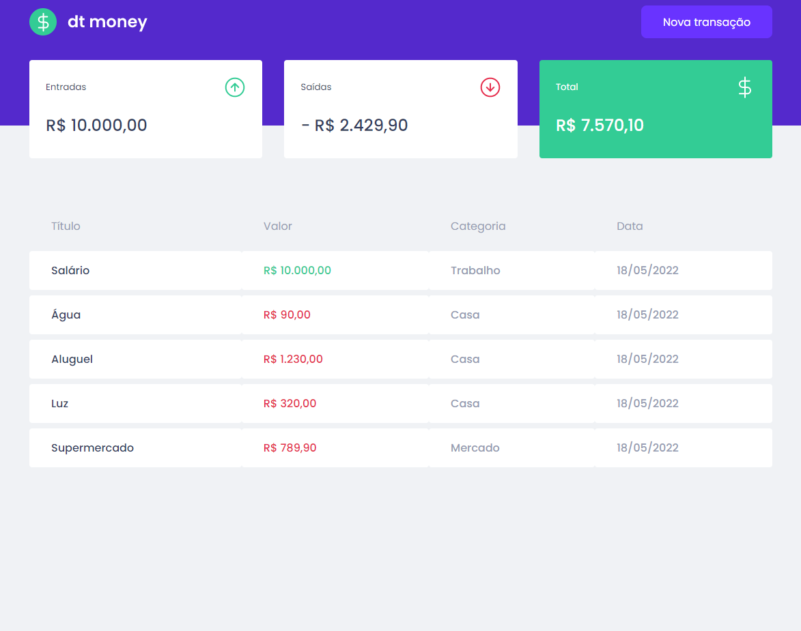
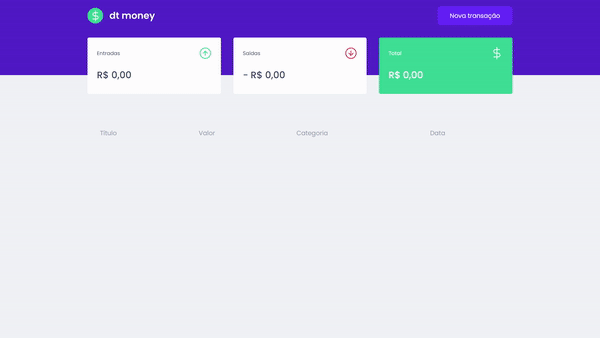

# Development project for study





## Technologies used

- ReactJS (ViteJS)
- Styled Components
- Axios
- MirageJS

## Instalação

Instalação das lib's do projeto com yarn

### Cloning of project

```bash
  git clone
```

### Access the project folder and instalation of lib's

```bash
  cd single-page-lead
  yarn
```

### Running the project

```bash
  yarn run dev
```
